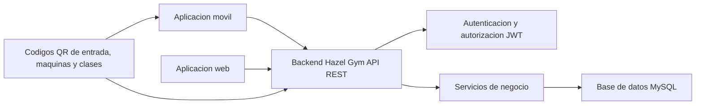

# Hazel Gym - Analisis y diseno inicial

## 1. Descripcion del tema del proyecto

Hazel Gym es una aplicacion orientada a la gestion de un gimnasio con enfoque multiplataforma. El sistema se apoya en un backend REST desarrollado con Spring Boot y una base de datos MySQL, y servira como base para una aplicacion movil y una aplicacion web.

El valor diferencial del proyecto es el uso de codigos QR en tres contextos:

- Control de acceso al gimnasio.
- Consulta de informacion sobre maquinas.
- Registro de asistencia a sesiones de clase.

El objetivo es ofrecer una solucion realista para mejorar la experiencia de clientes, entrenadores y administradores, manteniendo un alcance asumible para una entrega academica completa.

## 2. Definicion de roles de usuario

### Cliente

Es el usuario final del gimnasio. Puede autenticarse, consultar rutinas asignadas, escanear codigos QR de entrada y de maquinas, y consultar informacion relacionada con clases y cuotas.

### Entrenador

Gestiona clases y rutinas. Puede consultar su actividad, crear o editar rutinas, revisar clientes asignados y registrar asistencia relacionada con sesiones de clase mediante QR.

### Administrador

Gestiona la informacion global del sistema. Puede administrar usuarios, clases, maquinas, cuotas y supervisar el funcionamiento general de la plataforma.

## 3. Casos de uso principales

### Casos de uso comunes

- Iniciar sesion en la plataforma.
- Consultar informacion personal.
- Cerrar sesion.

### Cliente

- Escanear QR de entrada al gimnasio.
- Escanear QR de maquina para ver instrucciones y advertencias.
- Consultar rutinas asignadas.
- Consultar clases disponibles.
- Consultar cuotas informativas.

### Entrenador

- Iniciar sesion con rol TRAINER.
- Crear y editar rutinas.
- Asignar rutinas a clientes.
- Consultar clases asignadas.
- Registrar asistencia de sesion de clase mediante QR.

### Administrador

- Gestionar usuarios.
- Gestionar maquinas.
- Gestionar clases y sesiones.
- Gestionar cuotas.
- Consultar registros de asistencia.

## 4. Identificacion de entidades y relaciones

Las entidades principales del sistema son:

- `roles`: define los roles `CLIENT`, `TRAINER` y `ADMIN`.
- `usuarios`: almacena los usuarios del sistema y su rol.
- `maquinas`: representa cada maquina del gimnasio.
- `clases`: define una clase dirigida y su entrenador responsable.
- `sesiones_clase`: representa una instancia concreta de una clase en fecha y hora.
- `codigos_qr`: centraliza los QR de entrada, maquina y sesion.
- `asistencias`: registra cada escaneo realizado por un usuario.
- `rutinas`: contiene rutinas creadas por entrenadores.
- `rutinas_clientes`: asigna rutinas a clientes.
- `cuotas`: recoge los planes informativos del gimnasio.

### Relaciones principales

- Un `rol` puede estar asociado a muchos `usuarios`.
- Un `entrenador` puede impartir muchas `clases`.
- Una `clase` puede tener muchas `sesiones_clase`.
- Una `maquina` puede tener un codigo QR asociado.
- Una `sesion_clase` puede tener un codigo QR asociado.
- Un `usuario` puede registrar muchas `asistencias`.
- Un `codigo_qr` puede aparecer en muchas `asistencias`.
- Un `entrenador` puede crear muchas `rutinas`.
- Una `rutina` puede asignarse a muchos clientes mediante `rutinas_clientes`.

## 5. Diagrama general del sistema

## 6. Alcance funcional definido para esta fase

En esta fase inicial se fija un MVP centrado en:

- Gestion de usuarios por rol.
- Registro de asistencia mediante QR.
- Consulta de informacion de maquinas.
- Gestion de clases y sesiones.
- Gestion de rutinas.
- Consulta de cuotas.

Queda fuera del alcance actual cualquier sistema de puntos, ranking o recompensas, para mantener el proyecto dentro de un tamaño realista y entregable.

## 7. Arquitectura inicial prevista

El backend seguira una estructura por capas:

- `controller`: expone endpoints REST.
- `service`: implementa la logica de negocio.
- `repository`: acceso a datos con Spring Data JPA.
- `model`: entidades JPA.
- `dto`: objetos de entrada y salida.
- `exception`: gestion global de errores.
- `config/security`: configuracion transversal y seguridad.

## 8. Estado actual al 6 de mayo de 2026

- Base de datos creada y poblada con scripts SQL.
- Proyecto backend Maven creado y configurado para MySQL.
- Pendiente de implementar entidades JPA, CRUD, seguridad y documentacion Swagger.
